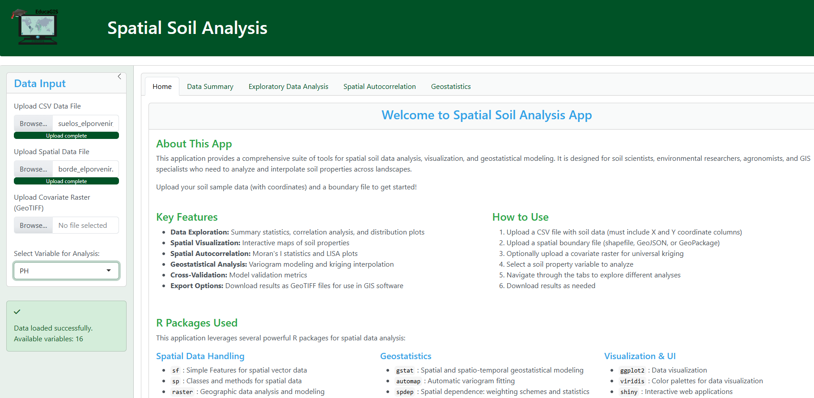
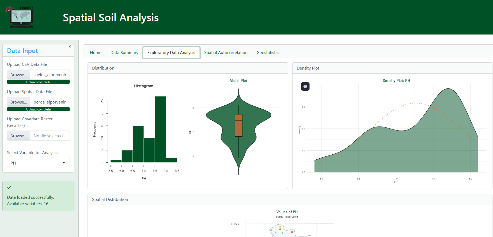
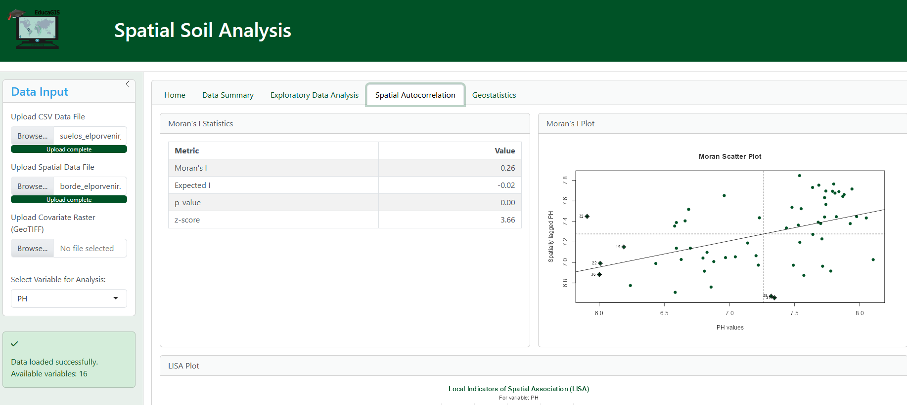
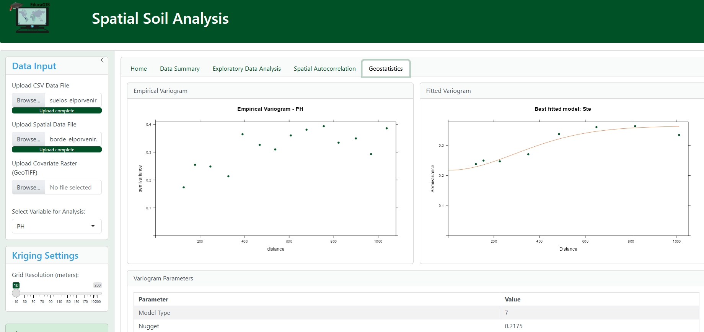

# Spatial Soil Analysis App

A comprehensive R Shiny application for spatial soil data analysis, visualization, and geostatistical modeling.



## Overview

This application provides a suite of tools for soil scientists, environmental researchers, agronomists, and GIS specialists who need to analyze and interpolate soil properties across landscapes. It combines powerful R packages for spatial data handling, geostatistical analysis, and visualization into an easy-to-use web interface.

## Key Features

- **Data Exploration**: Summary statistics, correlation analysis, and distribution plots
- **Spatial Visualization**: Interactive maps of soil properties
- **Spatial Autocorrelation**: Moran's I statistics and LISA plots
- **Geostatistical Analysis**: Variogram modeling and kriging interpolation
- **Cross-Validation**: Model validation metrics
- **Export Options**: Download results as GeoTIFF files for use in GIS software

## Screenshots

### Data Analysis



### Spatial Analysis



### Geostatistics



## R Packages Used

### Spatial Data Handling

- **sf**: Simple Features for spatial vector data
- **sp**: Classes and methods for spatial data
- **raster**: Geographic data analysis and modeling
- **tmap**: Thematic maps for spatial data

### Geostatistical Analysis

- **gstat**: Spatial and spatio-temporal geostatistical modeling
- **automap**: Automatic variogram fitting
- **spdep**: Spatial dependence: weighting schemes and statistics
- **fields**: Tools for spatial data including kriging

### Visualization & UI

- **ggplot2**: Data visualization
- **viridis**: Color palettes for data visualization
- **shiny**: Interactive web applications
- **bslib**: Bootstrap styling for Shiny apps
- **DT**: Interactive data tables
- **kableExtra**: Enhanced tables for reporting

## Installation and Usage

### Prerequisites

- R (version 4.0.0 or higher)
- Required R packages (see below)

### Installing Required Packages

```R
# Install required packages
install.packages(c("shiny", "sf", "sp", "raster", "tidyverse", "gstat", "automap",
                  "spdep", "ggplot2", "ggcorrplot", "ggpubr", "viridis",
                  "modelsummary", "fields", "interp", "mgcv", "RColorBrewer",
                  "tmap", "knitr", "DT", "kableExtra", "bslib", "shinyWidgets",
                  "zip", "tools", "moments"))
```

### Running the App Locally

1. Clone this repository
2. Open R or RStudio
3. Set your working directory to the app folder
4. Run the following command:

   ```R
   shiny::runApp()
   ```

### Using the App

1. Upload a CSV file with soil data (must include X and Y coordinate columns)
2. Upload a spatial boundary file (shapefile, GeoJSON, or GeoPackage)
3. Optionally upload a covariate raster for universal kriging
4. Select a soil property variable to analyze
5. Navigate through the tabs to explore different analyses
6. Download results as needed

## License

This project is licensed under the MIT License - see the LICENSE file for details.

## Acknowledgments

- Developed by Carlos Carbajal - EducaGIS
- Powered by R and Shiny
- Special thanks to the developers of all the R packages used in this application
